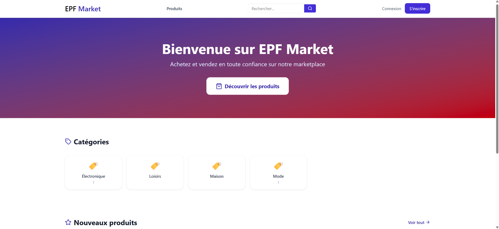
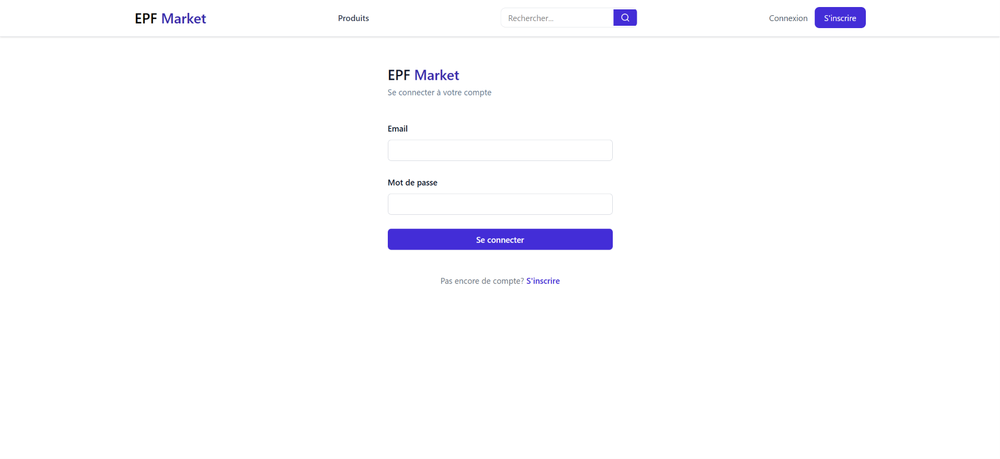
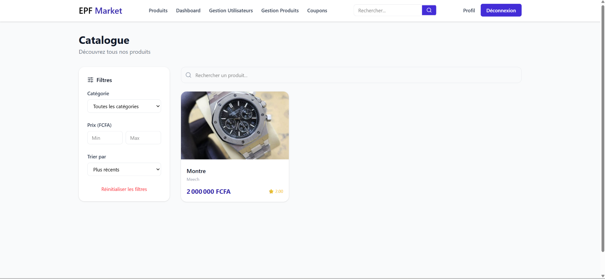
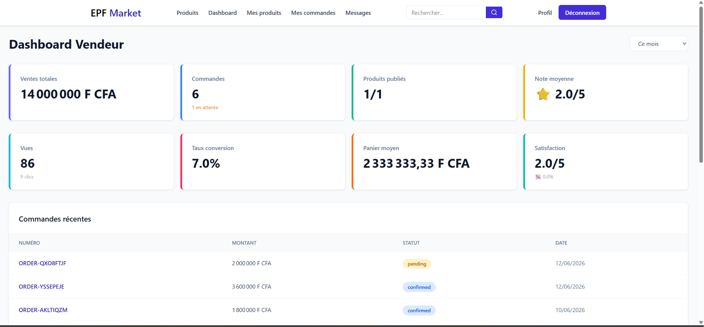
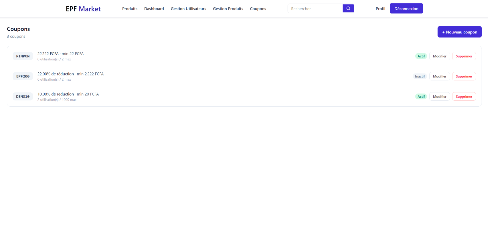

# EPF Marketplace — Frontend
 
Frontend réalisé avec React pour la plateforme **EPF Marketplace**, une marketplace e-commerce avec trois rôles utilisateurs (acheteur, vendeur, administrateur), développé par Héritier Edou METHOGHE et Eissa Michel BASSE de Bachelor CSI 3 à EPF Africa.
 
Le frontend consomme l'API REST Laravel disponible ici : [github.com/libasseld/epf-marketplace](https://github.com/libasseld/epf-marketplace)
 
---
 
## Sommaire
 
- [Stack technique](#stack-technique)
- [Captures d'écran](#captures-décran)
- [Prérequis](#prérequis)
- [Installation](#installation)
- [Variables d'environnement](#variables-denvironnement)
- [Lancer le projet](#lancer-le-projet)
- [Structure du projet](#structure-du-projet)
- [Fonctionnalités](#fonctionnalités)
- [Scripts disponibles](#scripts-disponibles)
- [Déploiement](#déploiement)
---
 
## Stack technique
 
| Catégorie | Technologie |
|---|---|
| Framework | React 18 + Vite |
| Routing | React Router DOM |
| Appels API | Axios |
| Formulaires | React Hook Form |
| Notifications | React Hot Toast |
| Style | Tailwind CSS |
| Authentification | Context API + Bearer Token (localStorage) |
 
---
 
## Captures d'écran
 
Les captures d'écran de l'application sont disponibles ci-dessous.
 
 

*Accueil*


*Page de connexion*
 

*Catalogue de produits avec filtres*
 

*Tableau de bord vendeur*
 

*Gestion des coupons (admin)*
 
---
 
## Prérequis
 
- [Node.js](https://nodejs.org/) version 18 ou supérieure
- npm (installé avec Node.js)
- Le backend Laravel **EPF Marketplace** doit être lancé en parallèle ([voir le repo](https://github.com/libasseld/epf-marketplace))
---
 
## Installation
 
Clone le projet puis installe les dépendances :
 
```bash
git clone https://github.com/ton-username/epf-marketplace-front.git
cd epf-marketplace-front
npm install
```
 
---
 
## Variables d'environnement
 
Crée un fichier `.env` à la racine du projet :
 
```bash
cp .env.example .env
```
 
Puis renseigne l'URL de l'API Laravel :
 
```dotenv
VITE_API_URL=http://localhost:8000/api
```
 
---
 
## Lancer le projet
 
Démarre le serveur de développement :
 
```bash
npm run dev
```
 
L'application est accessible sur :
 
```
http://localhost:5173
```
 
> Le backend Laravel doit tourner sur  `http://localhost:8000` (`php artisan serve`), sinon les appels API échoueront.
 
---
 
## Structure du projet
 
```
src/
├── components/      # Composants réutilisables (Navbar, ProductCard, ProtectedRoute...)
├── pages/           # Une page par route, organisées par rôle (buyer/, seller/, admin/)
├── contexts/         # AuthContext, CartContext — état global de l'application
├── services/        # Appels API (authService, productService, orderService...)
├── hooks/           # Hooks personnalisés (useAuth...)
├── App.jsx          # Déclaration des routes
└── main.jsx         # Point d'entrée de l'application
```
 
---
 
## Fonctionnalités
 
### Authentification
- Inscription (acheteur / vendeur)
- Connexion / déconnexion
- Profil utilisateur avec photo de profil
- Routes protégées selon le rôle
### Acheteur
- Catalogue de produits avec filtres, recherche et pagination
- Panier persistant
- Passage de commande avec coupon
- Suivi des commandes
- Favoris
- Messagerie avec les vendeurs
### Vendeur
- Gestion des produits (CRUD, statuts, promotions flash)
- Commandes reçues avec mise à jour du statut
- Tableau de bord avec statistiques
### Administrateur
- Statistiques globales de la plateforme
- Gestion des utilisateurs (suspension / réactivation)
- Modération des produits
- Gestion des coupons (CRUD)
---
 
## Scripts disponibles
 
| Commande | Description |
|---|---|
| `npm run dev` | Lance le serveur de développement |
| `npm run build` | Génère la version de production dans `dist/` |
| `npm run preview` | Prévisualise le build de production en local |
 
## Auteurs
 
Projet réalisé par **Héritier Edou METHOGHE et Eissa Michel BASSE** — EPF Africa, Bachelor CSI 3